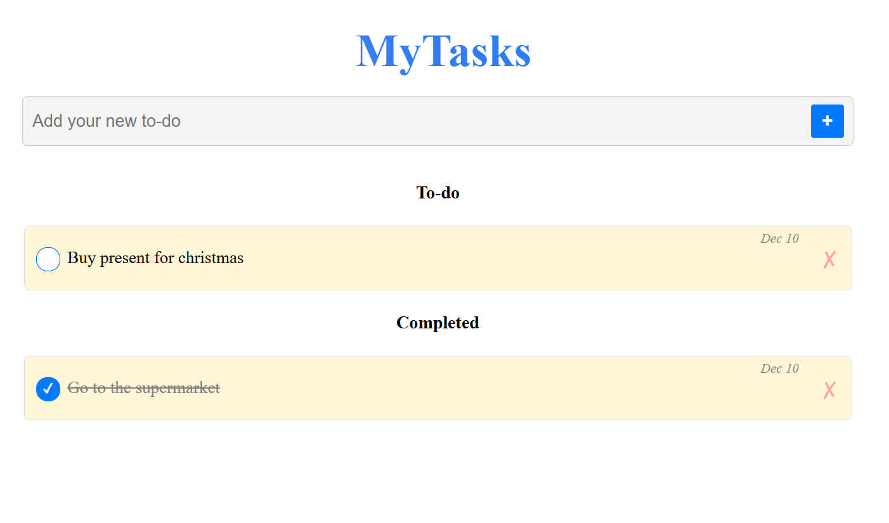

# MyTasks - Todo App

Todo application built with **React** and **TypeScript**.

It allows users to add tasks, mark them as completed, delete them, and automatically save all data using **localStorage**.

## Features

- Add new tasks
- Mark tasks as completed / uncompleted
- Delete tasks
- Persistent storage with **localStorage**
- Task counters (active and completed)
- Clean and modular component structure (`TodoApp`, `TodoItem`, etc.)
- Custom hook to automatically sync state with localStorage

## Tech Stack

- React + TypeScript
- useState, useEffect, custom hooks
- CSS3 (Flexbox, Media Queries)
- localStorage API
- Vite

## Quick Start

```bash
git clone https://github.com/adrianmarceloledesma/todo-app
cd todo-app
npm install
npm run dev
```

## Live Demo

https://todo-ijxuy0axj-marcelos-projects-a7a6cc0b.vercel.app/

## Preview



## What I learned

This project helped me practice React with TypeScript, custom hooks, state management, component composition, effects and localStorage persistence.
